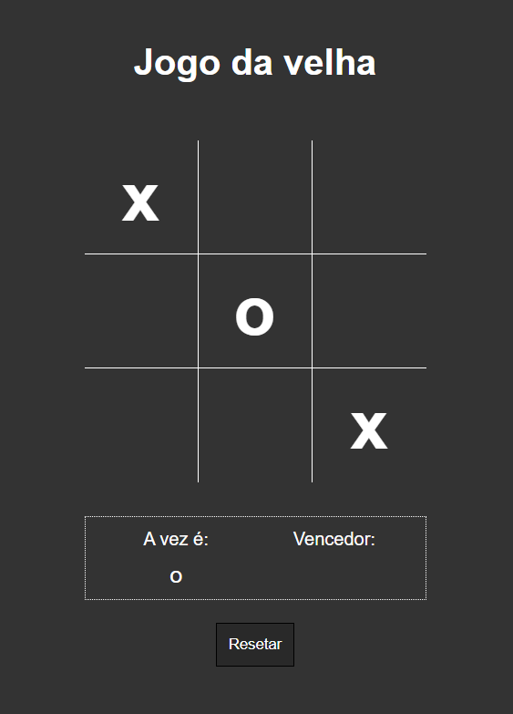

# tic-tac-toe-vanilla-JS

  <a href="#-tecnologias">Tecnologies</a>&nbsp;&nbsp;&nbsp;|&nbsp;&nbsp;&nbsp;
  <a href="#-projeto">Project</a>

 

 

## 🚀 Tecnologies

This project was developed with:

- HTML5
- CSS3
- Vanilla JavaScript

## 💻 Project

This project is a well-known Tic-Tac-Toe. 
To practice Vanilla JS.

## Run the project 

        //install dependencies
        npm install

        //Create DB
        npm run init-db

        //Run project
        npm start

Made with ♥ 
